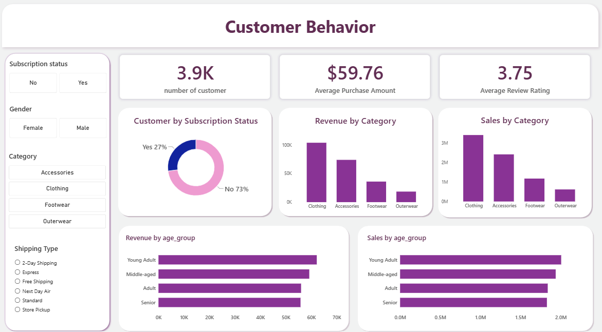

# Customer Shopping Behavior Analysis

## 📌 Project Overview

This project analyzes customer shopping behavior using transactional data from **3,900 purchases** across different product categories.

The objective is to understand customer spending patterns, product preferences, discount behavior, subscription behavior, and customer segments in order to support better business decisions.

The project follows an end-to-end data analytics workflow:

**Raw Data → Python → PostgreSQL → SQL Analysis → Power BI → Business Recommendations**

---

## 🎯 Business Questions

The analysis focuses on the following business questions:

1. Which gender generates the most revenue?
2. Do customers who use discounts still make high-value purchases?
3. Which products have the highest average ratings?
4. Does shipping type affect average purchase amount?
5. How do subscribers compare with non-subscribers?
6. Which products are most dependent on discounts?
7. How can customers be segmented based on purchase history?
8. What are the top 3 products within each category?
9. Are repeat buyers more likely to subscribe?
10. Which age groups contribute the most revenue?

---

## 📊 Dataset

The dataset contains:

- **3,900 transactions**
- **18 columns**
- Customer demographic information
- Purchase information
- Shopping behavior
- Product ratings
- Subscription information

---

## 🧹 Data Preparation with Python

Python and Pandas were used to prepare the dataset before performing the business analysis.

### Data Cleaning

The main steps included:

- Loading the dataset with Pandas
- Exploring the dataset using `df.info()` and `df.describe()`
- Checking missing values
- Handling **37 missing Review Rating values**
- Imputing missing ratings using the median rating of each product category
- Standardizing column names using `snake_case`
- Checking data consistency
- Removing the redundant `promo_code_used` column

### Feature Engineering

Two additional features were created:

- `age_group`
- `purchase_frequency_days`

---

## 🗄️ PostgreSQL Database

After cleaning the dataset in Python, the DataFrame was loaded into **PostgreSQL** for structured SQL analysis.

```text
Python / Pandas
      ↓
Cleaned DataFrame
      ↓
PostgreSQL
      ↓
SQL Business Analysis
```

The cleaned customer data was stored in a PostgreSQL table called:

```text
customer
```

---

## 🔎 SQL Business Analysis

SQL was used to answer the main business questions and identify customer and product patterns.

### Analysis Performed

#### 1. Revenue by Gender

Compared total revenue generated by male and female customers.

#### 2. High-Spending Discount Users

Identified customers who used discounts but still spent above the average purchase amount.

#### 3. Top 5 Products by Rating

Identified products with the highest average customer review ratings.

#### 4. Shipping Type Comparison

Compared average purchase amounts between:

- Standard Shipping
- Express Shipping

#### 5. Subscribers vs Non-Subscribers

Compared:

- Average spending
- Total revenue
- Subscription behavior

#### 6. Discount-Dependent Products

Identified the **5 products with the highest percentage of discounted purchases**.

#### 7. Customer Segmentation

Customers were classified into:

- New
- Returning
- Loyal

based on their purchase history.

#### 8. Top 3 Products per Category

Identified the most purchased products within each product category.

#### 9. Repeat Buyers & Subscriptions

Analyzed whether customers with more than **5 purchases** were more likely to subscribe.

#### 10. Revenue by Age Group

Calculated the total revenue contribution of each customer age group.

---

## 📈 Power BI Dashboard

The final analysis was presented through an interactive **Power BI dashboard**.

### Dashboard Preview



> Replace `images/customer-shopping-dashboard.png` with the actual location of your dashboard screenshot in your GitHub repository.

### Dashboard Focus

The dashboard communicates:

- Customer spending behavior
- Product performance
- Subscription behavior
- Customer segments
- Discount behavior
- Revenue patterns

---

## 💡 Key Findings

### Customer Behavior

The analysis shows that customer behavior can be examined through purchase frequency, previous purchases, subscription status, and spending patterns.

### Customer Segmentation

Customers were grouped into:

**New → Returning → Loyal**

This provides a framework for identifying customers who may benefit from retention and loyalty strategies.

### Discounts

The analysis identified products with a high proportion of discounted purchases.

This can help the business evaluate whether discounts are supporting sales growth while maintaining healthy margins.

### Products

Top-rated and best-selling products can be prioritized in marketing campaigns and product positioning.

### Subscriptions

The analysis examined the relationship between repeat purchasing behavior and subscription status, particularly among customers with more than five purchases.

### Age Groups

Revenue was analyzed across age groups to identify customer segments contributing the most revenue.

---

## 📌 Business Recommendations

### 1. Boost Subscriptions

Create exclusive benefits and incentives for subscribers to encourage more customers to subscribe.

### 2. Build Customer Loyalty

Reward repeat buyers and create strategies to move customers from:

**New → Returning → Loyal**

### 3. Review Discount Strategy

Evaluate discount-dependent products to balance sales growth with margin control.

### 4. Improve Product Positioning

Highlight highly rated and best-selling products in marketing campaigns.

### 5. Target High-Revenue Customer Groups

Focus marketing efforts on age groups and customer segments generating higher revenue.

### 6. Use Shipping Insights

Use shipping behavior, including express-shipping usage, to better understand high-value customers.

---

## 🛠️ Tools & Technologies

| Tool | Purpose |
|---|---|
| Python | Data cleaning and feature engineering |
| Pandas | Data manipulation and exploration |
| PostgreSQL | Database storage |
| SQL | Business analysis |
| Power BI | Dashboard and visualization |
| GitHub | Project documentation |

---


## 📁 Project Files

### 📊 Dataset

[View the cleaned customer dataset](cleaned_customer_data.csv)

### 🐍 Python Analysis

[View the Python notebook](customer_behavior_analysis.ipynb)

### 🗄️ SQL Analysis

[View the SQL queries](sql/customer_behavior_analysis.sql)

### 📈 Power BI Dashboard

[View the dashboard screenshot](images/customer-shopping-dashboard.png)

---

## 🚀 Key Takeaway

This project demonstrates an end-to-end approach to turning transactional customer data into business insights.

I used **Python for data preparation, PostgreSQL and SQL for business analysis, and Power BI for visualization**.

The main goal was not only to understand customer behavior, but to translate the analysis into **actionable recommendations around subscriptions, loyalty, discounts, products, and customer targeting**.
